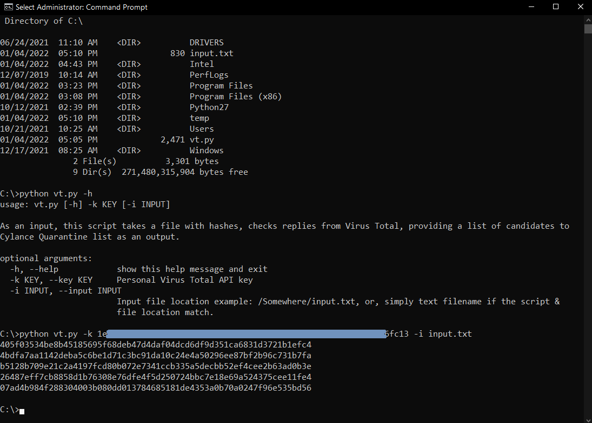

# CylanceGlobalList

Based on a current Cylance Global List functionality, it [only supports SHA256 format](https://docs.blackberry.com/en/unified-endpoint-security/cylance--products/blackberry-on-prem-administration-guide/Global_Lists/Add_a_Global_List_Entry). 

The use case for this script - when it comes to bulk hashes verification (not only SHA256) against Cylance engine in VirusTotal (for example, to add only relevant hashes into GlobalList). Hence, this script does the following:

- as an input takes a file with a list of hashes (various)
- queries VT API V2, looking for ‘sha256’ JSON field in reply.
- if SHA256 hash from the input was not found in VT ('No matches found') - script will still display that SHA256 hash (makes sense to consider it for Global List).
- if SHA256 hash from the input was found in VT, AND/OR a non-SHA256 hash has SHA256 equivalent in VT – next, script checks JSON fields related to Cylance, looking for ‘Not found’ and ‘Undetected’ scenarios (also candidates for Global list).
- in case of ‘Unable to process file type’ / ‘Timeout’ / ’Confirmed timeout’ statuses, regardless of hashes - such ones are not displayed.

There are no prerequisites other than list of hashes as an input.txt, python and:
```
pip install requests
```

Usage:
```
python vt.py -h
```
```
python vt.py -k Virus Total personal API key -i input.txt
```

